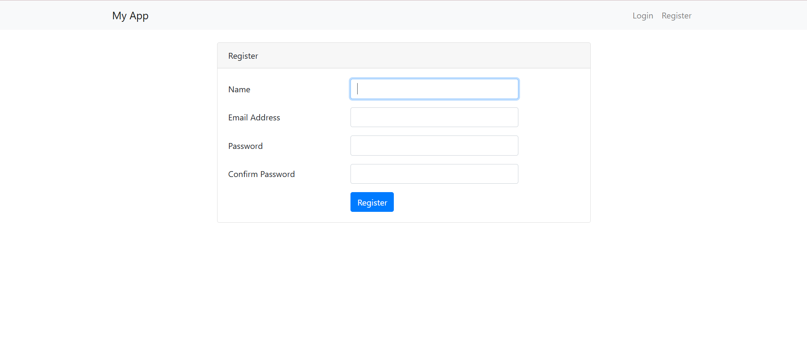
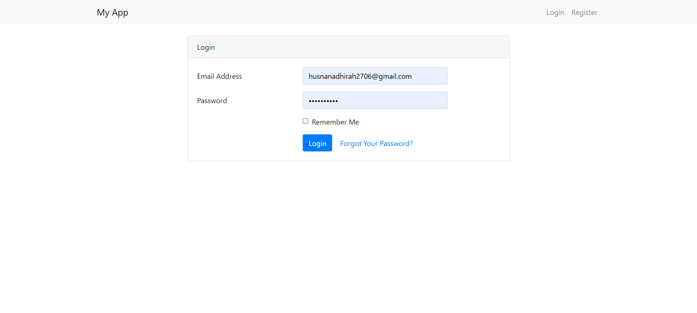
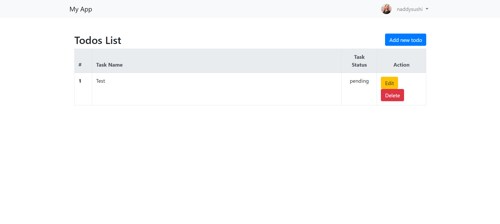

# Laravel Project

## Enhancements 
### 1. Model (`User.php`)
**Files modified:**
- `app/Models/User.php`
- `database/migrations/2025_04_18_045321_add_profile_fields_to_users_table.php`

**Enhancements:**
- Added new fields to the `users` table:
  - `nickname`
  - `avatar`
  - `phone`
  - `city`
  - `change password`
- Migration file created to update the database.

---

### 2. Views
**Files created/modified:**
- `resources/views/profile.blade.php`
- `resources/views/layouts/app.blade.php`
- `resources/views/auth/register.blade.php`
- `resources/views/auth/login.blade.php`

**Enhancements:**
- `profile.blade.php`:
  - View mode shows user info: nickname, email, phone, city, avatar
  - Edit mode allows updating info and uploading avatar
  - Password change field (optional)
  - Delete account button
- `layouts/app.blade.php`:
  - Displays user `nickname` in the top-right navigation
  - Shows avatar next to the nickname
- `register.blade.php` and `login.blade.php`:
  - Input validation using form request classes

---

### 3. Controller and Routing
**Files created/modified:**
- `app/Http/Controllers/ProfileController.php`
- `routes/web.php`

**Enhancements:**
- Created `ProfileController` with methods:
  - `show`, `edit`, `update`, and `destroy`
- Routes added to `web.php` to handle profile viewing, updating, and deleting:
  - `/profile` (view)
  - `/profile/edit` (edit)
  - `/profile/update` (update)
  - `/profile/destroy` (delete)

---

### 4. Form Request Validation
**Files created:**
- `app/Http/Requests/RegisterRequest.php`
- `app/Http/Requests/LoginRequest.php`

**Enhancements:**
- Registration and login fields validated using Laravel Form Request classes
- Name fields validated using regex to allow only A–Z and a–z characters

---
## Screenshots

### 1. Welcome Page

### 2. Register Page

### 3. Login Page

### 4. Todo Page

### 5. Profile Page

### 6. Edit Profile Page

## GitHub Repository URL

[https://github.com/nadhirahanwar/myApp](https://github.com/nadhirahanwar/myApp)

