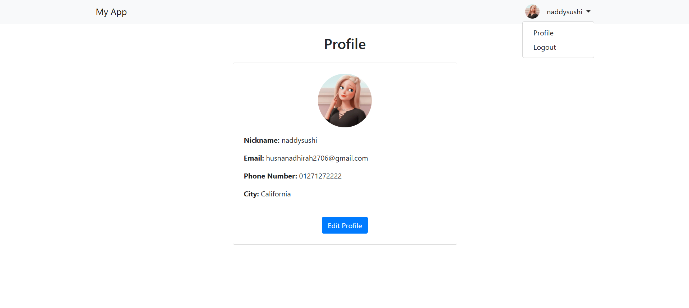
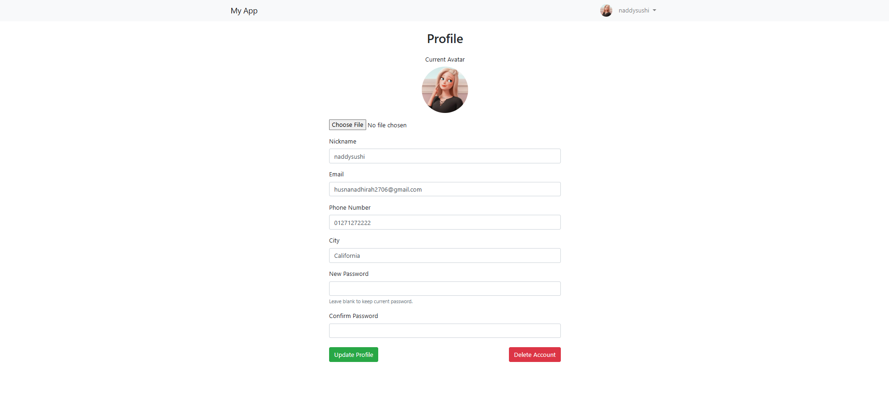
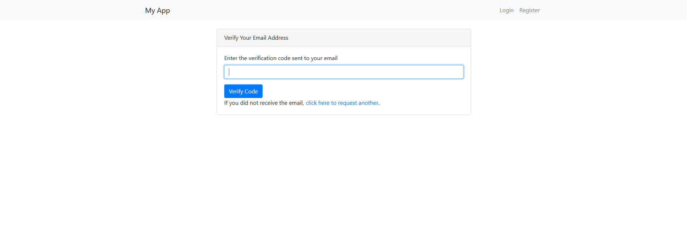

# Laravel Project

# Assignment 1
## Enhancements 
### 1. Model (`User.php`)
**Files modified:**
- `app/Models/User.php`
- `database/migrations/2025_04_18_045321_add_profile_fields_to_users_table.php`

**Enhancements:**
- Added new fields to the `users` table:
  - `nickname`
  - `avatar`
  - `phone`
  - `city`
  - `change password`
- Migration file created to update the database.

---

### 2. Views
**Files created/modified:**
- `resources/views/profile.blade.php`
- `resources/views/layouts/app.blade.php`
- `resources/views/auth/register.blade.php`
- `resources/views/auth/login.blade.php`

**Enhancements:**
- `profile.blade.php`:
  - View mode shows user info: nickname, email, phone, city, avatar
  - Edit mode allows updating info and uploading avatar
  - Password change field (optional)
  - Delete account button
- `layouts/app.blade.php`:
  - Displays user `nickname` in the top-right navigation
  - Shows avatar next to the nickname
- `register.blade.php` and `login.blade.php`:
  - Input validation using form request classes

---

### 3. Controller and Routing
**Files created/modified:**
- `app/Http/Controllers/ProfileController.php`
- `routes/web.php`

**Enhancements:**
- Created `ProfileController` with methods:
  - `show`, `edit`, `update`, and `destroy`
- Routes added to `web.php` to handle profile viewing, updating, and deleting:
  - `/profile` (view)
  - `/profile/edit` (edit)
  - `/profile/update` (update)
  - `/profile/destroy` (delete)

---

### 4. Form Request Validation
**Files created:**
- `app/Http/Requests/RegisterRequest.php`
- `app/Http/Requests/LoginRequest.php`

**Enhancements:**
- Registration and login fields validated using Laravel Form Request classes
- Name fields validated using regex to allow only A–Z and a–z characters

---
## Screenshots

### 1. Welcome Page

### 2. Register Page

### 3. Login Page

### 4. Todo Page

### 5. Profile Page

### 6. Edit Profile Page

---

# Assignment 2
### Enhancements

#### 1. Multi-Factor Authentication (MFA)
**Files modified/created:**
- `app/Http/Controllers/Auth/LoginController.php`
- `app/Models/User.php`
- `resources/views/auth/verify-mfa.blade.php`
- `routes/web.php`
- `app/Actions/Fortify/CreateNewUser.php`

**Enhancements:**
- Integrated **Multi-Factor Authentication (MFA)** using the **Laravel Fortify** package.
- The user is required to verify through link sent to their email after they successfully log in with their username and password.
- The code expires after **10 minutes**.
- Added a **resend MFA link**.

---

### 2. Password Hashing with Salt (Bcrypt)
**Files modified:**
- `app/Models/User.php`
- `config/hashing.php`
- `app/Actions/Fortify/CreateNewUser.php`

**Enhancements:**
- Implemented **password hashing** using **Bcrypt**.
- **Salts** are generated for each password during registration and stored in the `users` table.
- The password and salt are concatenated and then hashed to provide an extra layer of security.

---

### 3. Rate Limiting for Login Attempts
**Files modified:**
- `app/Providers/RouteServiceProvider.php`
- `routes/web.php`

**Enhancements:**
- Used **Laravel RateLimiter** to limit **login attempts to 3** within **a minute**.
- After 3 failed login attempts, the user is temporarily blocked and must wait before trying again.
  
---

### 4. User Registration Enhancements
**Files modified/created:**
- `app/Models/User.php`
- `app/Actions/Fortify/CreateNewUser.php`

**Enhancements:**
- Added **salts** for passwords during user registration.
- A **random alphanumeric salt** is generated for each user and stored in the `users` table.
- The password is concatenated with the salt before being hashed using **Bcrypt**.

---

### 5. Views for MFA
**Files created/modified:**
- `resources/views/auth/verify-mfa.blade.php`

**Enhancements:**
- Created a **view for MFA verification**, where the user see after they logim.

---

### 6. Routes for MFA and Login
**Files modified:**
- `routes/web.php`

**Enhancements:**
- Created routes for **MFA verification**, **resending MFA codes**, and **updating user credentials after MFA verification**.

## Screenshots
### 1. Verify MFA

---

## Assignment 3

### Enhancements

#### 1. Role-Based Access Control (RBAC)

**Files modified/created:**

* `app/Models/User.php`
* `app/Http/Controllers/ProfileController.php`
* `app/Models/UserRole.php`
* `app/Models/RolePermission.php`
* `database/migrations/2025_05_23_070905_create_user_roles_table.php`
* `database/migrations/2025_05_23_071044_create_roles_table.php`
* `database/migrations/2025_05_23_090723_create_user_roles_permissions_table.php`
* `routes/web.php`

**Enhancements:**

* Implemented **Role-Based Access Control (RBAC)** to manage access to different pages and actions based on user roles (e.g., Admin, User).
* Created tables:

  * **`UserRoles`**: Stores the roles assigned to users (e.g., Admin, User).
  * **`RolePermissions`**: Defines the actions (CRUD) that each role can perform (Create, Retrieve, Update, Delete).

---

#### 2. Authorization Layer

**Files modified:**

* `app/Http/Middleware/AuthorizeRole.php`
* `routes/web.php`

**Enhancements:**

* Added an **authorization middleware** that checks if the user has the required role before allowing access to certain pages.
* **Redirect Logic**: Registered users are redirected to the **To-Do page**, while administrators are redirected to the **admin dashboard**.

---

#### 3. User Permissions

**Files modified/created:**

* `app/Http/Controllers/AdminController.php`
* `resources/views/admin/user-list.blade.php`

**Enhancements:**

* **Admin users** have access to **CRUD operations** on the user list, including:

  * User deletion
  * User activation/deactivation
* **User roles and permissions** ensure that normal users only have access to their **To-Do list** and cannot modify other users' tasks or data.

---

#### 4. Testing RBAC

**Files modified/created:**

* `app/Http/Controllers/TodoController.php`
* `resources/views/todo/create.blade.php`

**Enhancements:**

* **RBAC Testing**: If a user has permission to create a To-Do list, they can only see the **"New List"** or **"New Task"** buttons, while other operation buttons are hidden based on the permissions granted.

---

